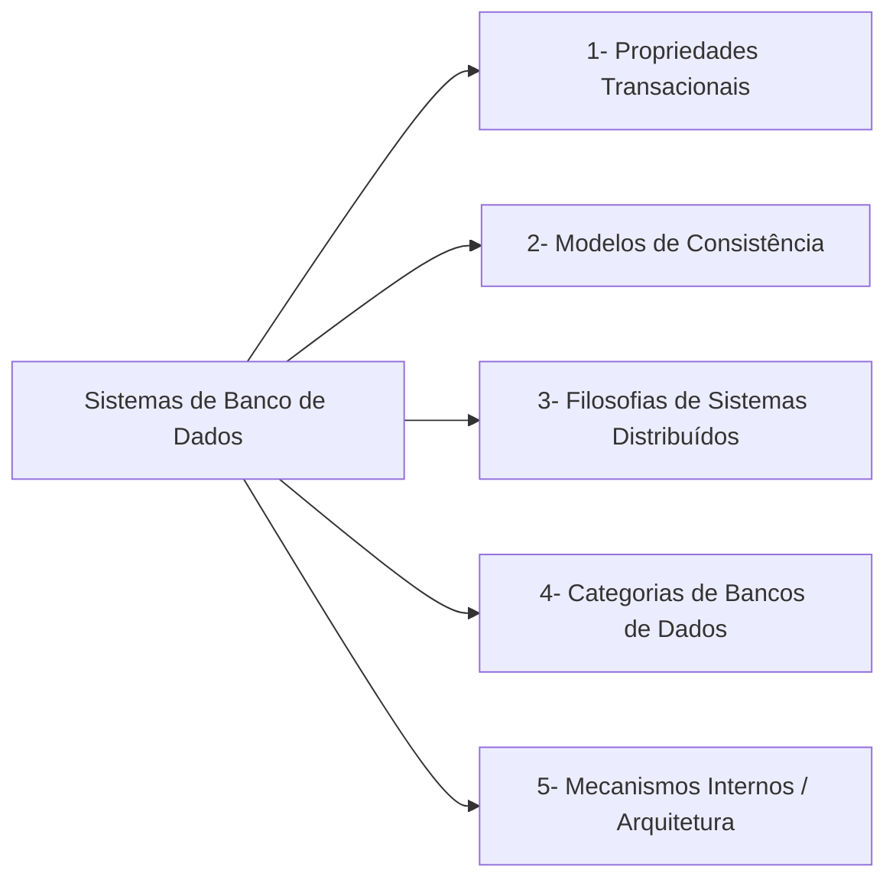
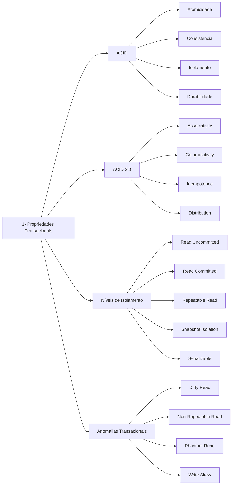
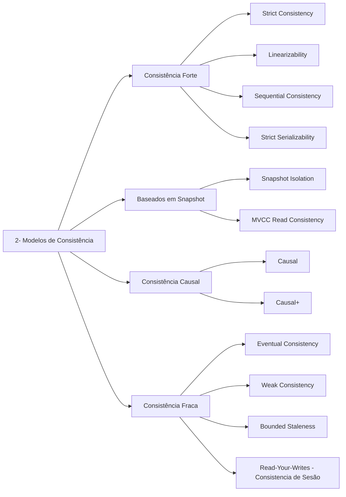
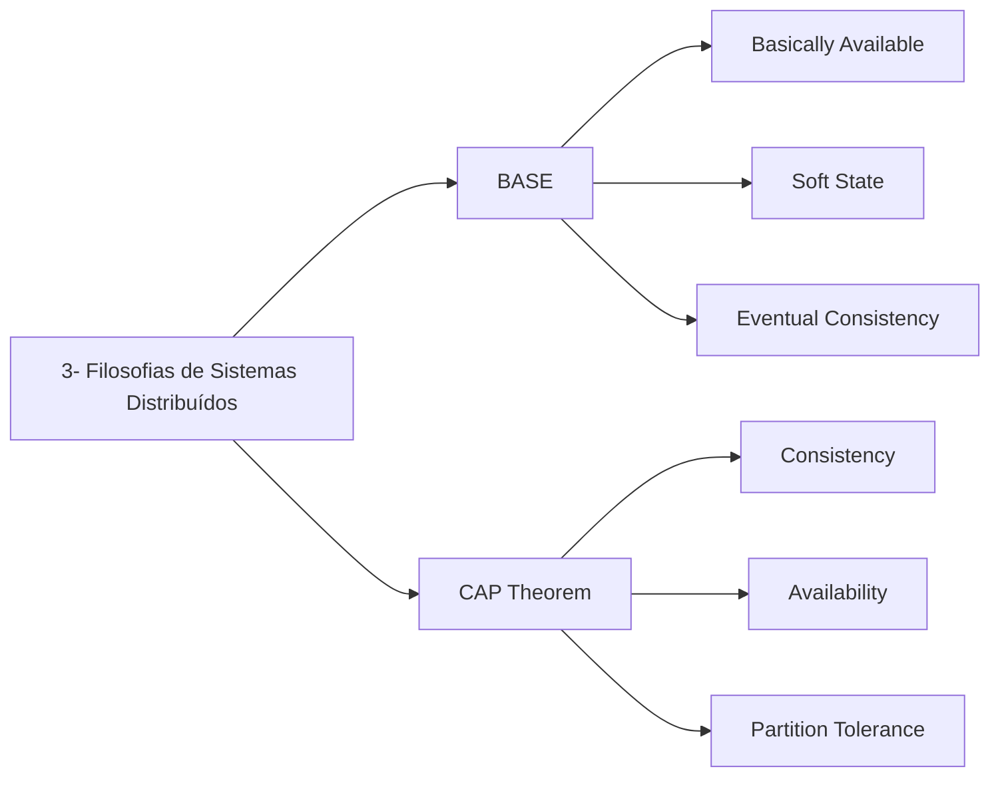
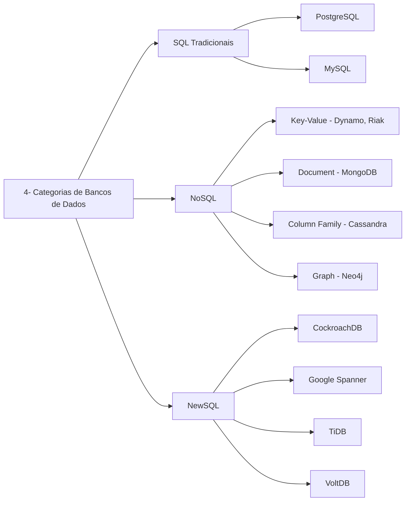
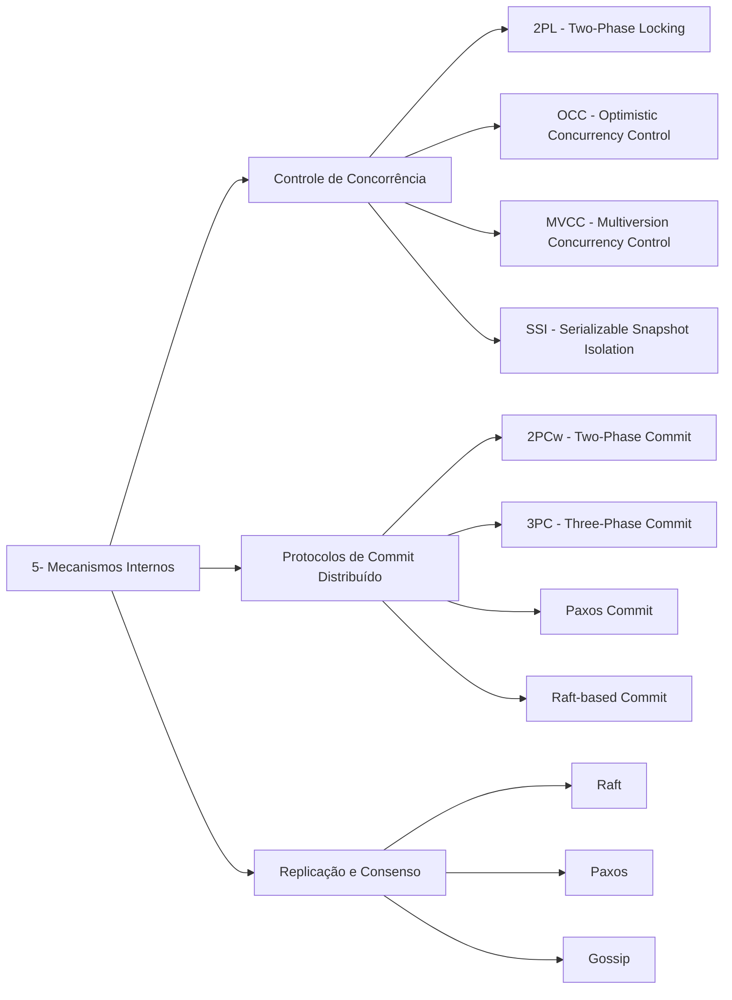

#### Table of Content

##### Propriedades Transacionais

    
 Grafico de Conteudos 

##### Modelos de Consistencia

    
 Grafico de Conteudos 

##### Filosofias de Sistemas Distribuídos

    
 Grafico de Conteudos 

##### Categorias de Bancos de Dados

    
 Grafico de Conteudos 

##### Mecanismos Internos e Arquiteturais

    
 Grafico de Conteudos 

