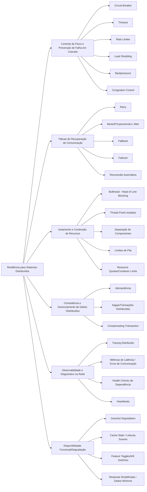

```mermaid
graph LR

    A[Resiliência para Sistemas Distribuídos]

    %% Categorias Principais
    A --> B[Controle de Fluxo e Prevenção de Falha em Cascata]
    A --> C[Táticas de Recuperação de Comunicação]
    A --> D[Isolamento e Contenção de Recursos]
    A --> E[Consistência e Gerenciamento de Dados Distribuídos]
    A --> F[Observabilidade e Diagnóstico na Rede]
    A --> G[Disponibilidade Funcional/Degradação]

    %% Controle de Fluxo (Evitar sobrecarga e propagação)
    B --> B1[Circuit Breaker]
    B --> B2[Timeout]
    B --> B3[Rate Limiter ]
    B --> B4[Load Shedding]
    B --> B5[Backpressure]
    B --> B6[Congestion Control]

    %% Táticas de Recuperação (Reagir a falhas transientes de rede)
    C --> C1[Retry]
    C --> C2[Backoff Exponencial e Jitter]
    C --> C3[Fallback]
    C --> C4[Failover]
    C --> C5[Reconexão Automática]

    %% Isolamento e Contenção (Limitar o raio da falha)
    D --> D1[Bulkhead - Head of Line Blocking]
    D --> D2[Thread Pools Isolados]
    D --> D3[Separação de Componentes ]
    D --> D4[Limites de Fila ]
    D --> D5[Resource Quotas/Container Limits]

    %% Consistência e Gerenciamento de Dados Distribuídos
    E --> E1[Idempotência]
    E --> E2[Sagas/Transações Distribuídas]
    E --> E4[Compensating Transaction]

    %% Observabilidade e Diagnóstico (Onde e por que a rede falhou)
    F --> F1[Tracing Distribuído]
    F --> F2[Métricas de Latência / Erros de Comunicação]
    F --> F3[Health Checks de Dependência]
    F --> F4[Heartbeats]

    %% Disponibilidade Funcional (Manter a funcionalidade mesmo com falha)
    G --> G1[Graceful Degradation]
    G --> G2[Cache Stale / Leituras Suaves]
    G --> G3[Feature Toggles/Kill Switches]
    G --> G4[Resposta Simplificada / Dados Mínimos]
```