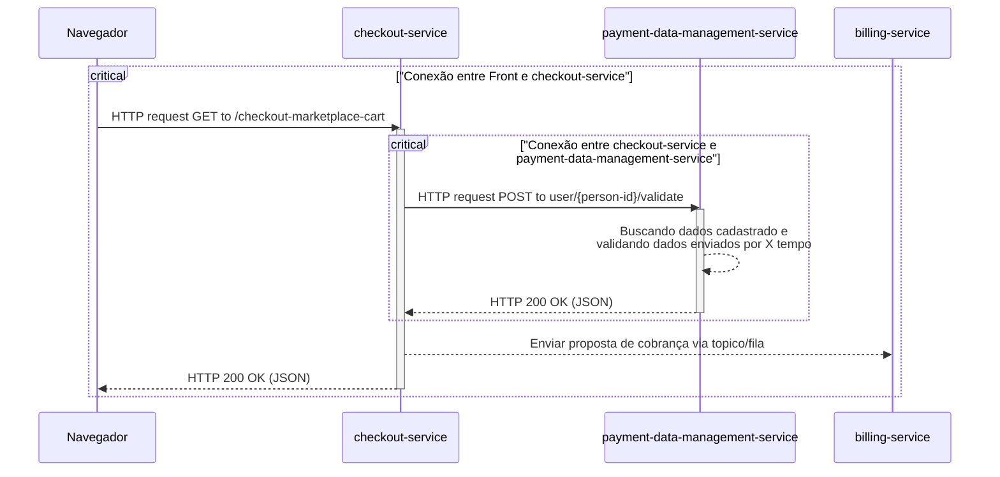

# Timeout/TimeLimiter - Paciencia tem limite

Esse padrão de resiliencia é um daqueles padrões que todo mundo ja usou em algum momento ou consumiu alguma aplicação que usava. Por conta de limitações de rede, timeouts existem em qualquer lugar. É provavel que mesmo no seu navegador, pelos sites voce ja tenha tomado um num momento em que existia uma carga de rede muito alta. Em sites de eventos nacionais de larga escala, como promoções a aplicações de provas, é muito comum acotecer de se tomar um timeout mesmo nos respectivos sites. 

Por definição, ***esse padrão basicamente impõe um tempo maximo de requsição que pode ser suportada e se a operação não for concluida dentro daquele periodo de tempo, ela é interrompida e descartada***, e uma excessão de timeout é lançada. Para entender a importancia, vamos para um caso de uso.

## Caso de uso: Realizar uma compra

Imagine o seguinte cenário : Voce está lá no site do seu marketplace favorito, e por algum motivo que não vem ao caso, ao realizar um checkout das suas compras, o serviço de checkout faz uma requisição de validação para um outro serivço de validação de meios de pagamento (para saber se aquele cartão virtual que voce colocou não está desabilitado). O grafico Mermaid abaixo mostra esse cenário em um caos feliz, onde tudo dá sempre certo. 

Na hora que esse acoplamento fica claro, uma duvida vem a mente: O que acontece se o payment-data-management-service ficar por N segundos com essa consulta ativa por algum erro de desenvolvimento ou algum lock ? Todos os usuarios que estão fazendo checkout vão ficar N segundos com a tela de loading no app ou no site ? 

Os usuarios precisam de uma resposta, mesmo que ela seja uma negativa do tipo "Estamos passando por problemas tecnicos, tente novamente mais tarde." 

Pra isso voce adiciona um TimeLimiter, caso uma das requisições demore mais que os X segundos que voce estabeleceu, a resposta automaticamente vira um timeout. 

## Tradeoffs de se usar TimeLimiter

Utilizar um timeout bem definido em sua aplicação que depende de outras pode trazer diversas vantagens, dentre elas talvez a Proteção contra latencia baixa seja a mais notavel de todas. Junto dela vem outras vantagens como Falha rapida consciente. Configurar um Timeout Duration (Tempo para responder timeout) certo para a aplicação é essencial.

Em contrapartida, também existem desvantagens de se usar ele. Dentro as desvantagens estão a execução de Ghost Request, e consequentemente uma sobrecarga de rede e processamento, mesmo quando sua resposta informando o erro ja tenha sido dada. Para que essa desvantagem seja superada se fazem necessários mecanismos de cancelamento, o que pode aumentar a complexidade do codigo entre os serviços. 

## Implementação 
 
[Aqui](./exmple-project/) é possivel encontrar uma pasta, dentro desta pasta há um pequeno projeto em Kotlin, Gradle e Spring Boot com o Resilience4J. Esse projeto implementa APENAS o TimeLimiter.

A estrutura do projeto é simples: Um controller e uma service. Nesta service há hum metodo que tem um `TimeUnit.MILLISECONDS.sleep(N)`, onde N é um numero que pode ser 1 ou o Timestemp de uma variavel LocalDateTime. Essa escolha é feita através do resto da divisão do prorpio timestemp. 
