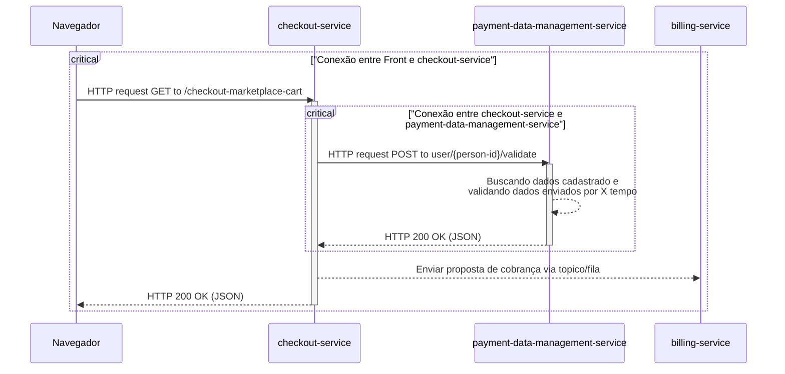

# Timeout/TimeLimiter - Paciencia tem limite

Esse padrão de resiliencia é um daqueles padrões que todo mundo ja usou em algum momento ou consumiu alguma aplicação que usava. Por conta de limitações de rede, timeouts existem em qualquer lugar. É provavel que mesmo no seu navegador, pelos sites voce ja tenha tomado um num momento em que existia uma carga de rede muito alta. Em sites de eventos nacionais de larga escala, como promoções a aplicações de provas, é muito comum acotecer de se tomar um timeout mesmo nos respectivos sites. 

Por definição, ***esse padrão basicamente impõe um tempo maximo de requsição que pode ser suportada entre dois serviços e se a operação não for concluida dentro daquele periodo de tempo, ela é interrompida e descartada***, e uma excessão de timeout é lançada para que caso haja falhas, a falha aconteça de forma rapida sem que prejudique completamente o serviço que realizou a requisição. O Objetivo crucial é protejer recursos como threads e pools de conexão, e impedir que eles fiquem bloqueados indefinidamente por conta de um serviço dependente.

### Caso de uso: Realizar uma compra

Imagine o seguinte cenário : Voce está lá no site do seu marketplace favorito, e por algum motivo que não vem ao caso, ao realizar um checkout das suas compras, o serviço de checkout faz uma requisição de validação para um outro serivço de validação de meios de pagamento (para saber se aquele cartão virtual que voce colocou não está desabilitado). O grafico Mermaid abaixo mostra esse cenário em um caos feliz, onde tudo dá sempre certo. 

Na hora que esse acoplamento fica claro, uma duvida vem a mente: O que acontece se o payment-data-management-service ficar por 30 segundos com essa consulta ativa por algum erro de desenvolvimento ou algum lock ? Todos os usuarios que estão fazendo checkout vão ficar N segundos com a tela de loading no app ou no site ? Se o serviço `payment-data-management-service` travar por 30 segundos, as threads e as pools do serviço `checkout-service` também estarão travadas, e isso vai impedir o serviço de responder as requisições dos usuários. Nesse ponto a lentidão de um serviço (se não tratada) pode afetar todo o fluxo e consequentimente a experiencia do usuário.

Para esse tipo de cenário critico, é necessário falhar rapido para responder rapido. Os usuarios precisam de uma resposta, mesmo que ela seja parecida com "Estamos passando por problemas tecnicos, tente novamente mais tarde."  Pra isso voce adiciona um Timeout, caso uma das requisições demore mais que os X segundos que voce estabeleceu, a resposta automaticamente vira um timeout. 

### Tradeoffs de se usar Timeout

Utilizar um timeout bem definido em sua aplicação que depende de outras pode trazer diversas vantagens, dentre elas talvez a Proteção contra latencia baixa seja a mais notavel de todas. Junto dela vem outras vantagens como Falha rapida consciente. Configurar um Timeout Duration (Tempo para responder timeout) certo para a aplicação é essencial.

Em contrapartida, existem desvantagens de se usar ele. Uma das maiores desvantagens é que podem aparecer Ghost Requests, isto é , requisições que foram canceladas, mas que continuam sendo processadas no serviço solicitado. Uma das caracteristicas do Timeout é interromper o serviço chamador , mas não o chamado. 
Consequentemente uma sobrecarga de rede e processamento pode acontecer, mesmo quando sua resposta informando o erro ja tenha sido dada. Para que essa desvantagem seja superada se fazem necessários mecanismos de cancelamento, o que pode aumentar a complexidade do codigo entre os serviços. 

No entanto o principal dessafio de se implementar um Timeout é com certeza o balanceamento na hora de escolher um tempo. Definir um tempo curto demais pode fazer com que sua aplicação se teorne um centro de falhas falsas, e definir um tempo longo demais pode fazer com que voce se torne o gargalo. É necessário analisar mais de perto principalmente se seus timeouts forem em operações de escrita. Para uma abordagem interessante,é necessário analisar as metricas do serviço solicitante e do solicitado, assim fica claro quais são os tempos no pior e no melhor caso em condições normais.

### Extra: Implementação 
 
[Aqui](./exmple-project/) é possivel encontrar uma pasta, dentro desta pasta há um pequeno projeto em Kotlin, Gradle e Spring Boot com o Resilience4J. Esse projeto implementa APENAS o Timeout.

A estrutura do projeto é simples: Um controller e uma service. Nesta service há hum metodo que tem um `TimeUnit.MILLISECONDS.sleep(N)` que é responsavel por deixar o serviço em espera para que o timeout possa entrar em ação.  

Embora essencial, o Timeout é apenas a primeira linha de defesa. Ele não consegue monitorar a saúde do serviço dependente nem evitar que ele seja sobrecarregado repetidamente. Por isso, é importante salientar que apesar de poder ser aplicado sozinho, o Timeout normalmente está muito bem acompanhado de outros padrões: CircuitBreaker, Bulkhead, Fallback, Retry, Idempotency e Graceful Degradation.
