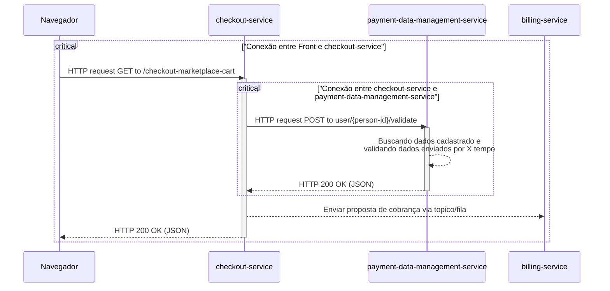

# Timeout/Time Limiter - Paciência Tem Limite 

Esse padrão de resiliência é um daqueles padrões que todo mundo já usou em algum momento ou consumiu alguma aplicação que o usava. Por conta de limitações de rede, timeouts existem em qualquer lugar. É provável que, mesmo no seu navegador, pelos sites, você já tenha tomado um timeout em um momento em que existia uma carga de rede muito alta. Em sites de eventos nacionais de larga escala, como promoções ou aplicações de provas, é muito comum acontecer de se tomar um timeout mesmo nos respectivos sites. 

Por definição, ***esse padrão basicamente impõe um tempo máximo de requisição que pode ser suportado entre dois serviços e, se a operação não for concluída dentro daquele período de tempo, ela é interrompida e descartada***. Uma exceção de timeout é lançada para que, caso haja falhas, a falha aconteça de forma rápida, sem que prejudique completamente o serviço que realizou a requisição. ***O objetivo crucial é proteger recursos*** como threads e pools de conexão, impedindo que eles fiquem bloqueados indefinidamente por conta de um serviço dependente.

---

### Caso de uso: Realizar uma compra 

Imagine o seguinte cenário: Você está lá no site do seu *marketplace* favorito e, por algum motivo que não vem ao caso, ao realizar um *checkout* das suas compras, o serviço de *checkout* faz uma requisição de validação para um outro *serviço* de validação de meios de pagamento (para saber se aquele cartão virtual que você colocou não está desabilitado). O gráfico Mermaid abaixo mostra esse cenário em um caso feliz, onde tudo dá sempre certo. 

Na hora que esse acoplamento fica claro, uma dúvida vem à mente: O que acontece se o `payment-data-management-service` ficar por 30 segundos com essa consulta ativa por algum erro de desenvolvimento ou algum lock? Todos os usuários que estão fazendo checkout vão ficar N segundos com a tela de loading no app ou no site? Se o serviço `payment-data-management-service` travar por 30 segundos, as threads e as pools do serviço `checkout-service` também estarão travadas, e isso vai impedir o serviço de responder às requisições dos usuários. Nesse ponto, a lentidão de um serviço (se não tratada) pode afetar todo o fluxo e, consequentemente, a experiência do usuário.

Para esse tipo de cenário crítico, é necessário falhar rápido para responder rápido. Os usuários precisam de uma resposta, mesmo que ela seja parecida com "Estamos passando por problemas técnicos, tente novamente mais tarde." Para isso, você adiciona um Timeout; caso uma das requisições demore mais que os X segundos que você estabeleceu, a resposta automaticamente vira um timeout. 

### Tradeoffs de se usar Timeout

UUtilizar um timeout bem definido em sua aplicação que depende de outras pode trazer diversas vantagens. Dentre elas, talvez a Proteção contra latência baixa seja a mais notável de todas. Junto dela vêm outras vantagens como Falha rápida consciente. Configurar um Timeout Duration (Tempo para responder timeout) certo para a aplicação é essencial.

Em contrapartida, existem desvantagens de se usar ele. Uma das maiores desvantagens é que podem aparecer Ghost Requests, isto é, requisições que foram canceladas, mas que continuam sendo processadas no serviço solicitado. Uma das características do Timeout é interromper o serviço chamador, mas não o chamado. Consequentemente, uma sobrecarga de rede e processamento pode acontecer, mesmo quando sua resposta informando o erro já tenha sido dada. Para que essa desvantagem seja superada, fazem-se necessários mecanismos de cancelamento, o que pode aumentar a complexidade do código entre os serviços.

No entanto, o principal desafio de se implementar um Timeout é, com certeza, o balanceamento na hora de escolher um tempo. Definir um tempo curto demais pode fazer com que sua aplicação se torne um centro de falhas falsas, e definir um tempo longo demais pode fazer com que você se torne o gargalo. É necessário analisar mais de perto, principalmente se seus timeouts forem em operações de escrita. Para uma abordagem interessante, é necessário analisar as métricas do serviço solicitante e do solicitado, assim fica claro quais são os tempos no pior e no melhor caso em condições normais.

### Extra: Implementação 
 
[Aqui](./exmple-project/) é possível encontrar uma pasta. Dentro desta pasta, há um pequeno projeto em Kotlin, Gradle e Spring Boot com o Resilience4J. Esse projeto implementa apenas o Timeout.

A estrutura do projeto é simples: Um controller e uma service. Nesta service, há um método que tem um `TimeUnit.MILLISECONDS.sleep(N)` que é responsável por deixar o serviço em espera para que o timeout possa entrar em ação.

Embora essencial, o Timeout é apenas a primeira linha de defesa. Ele não consegue monitorar a saúde do serviço dependente nem evitar que ele seja sobrecarregado repetidamente. Por isso, é importante salientar que, apesar de poder ser aplicado sozinho, o Timeout normalmente está muito bem acompanhado de outros padrões: Circuit Breaker, Bulkhead, Fallback, Retry, Idempotency e Graceful Degradation.